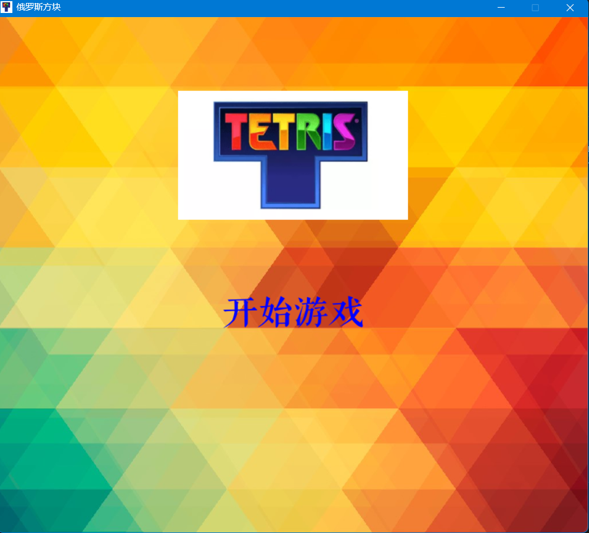
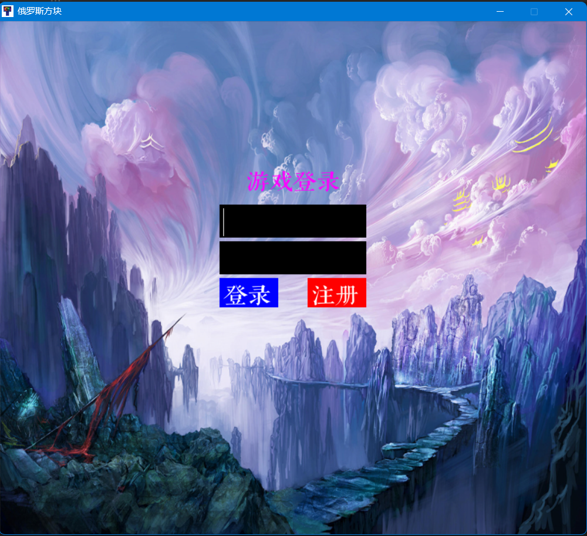
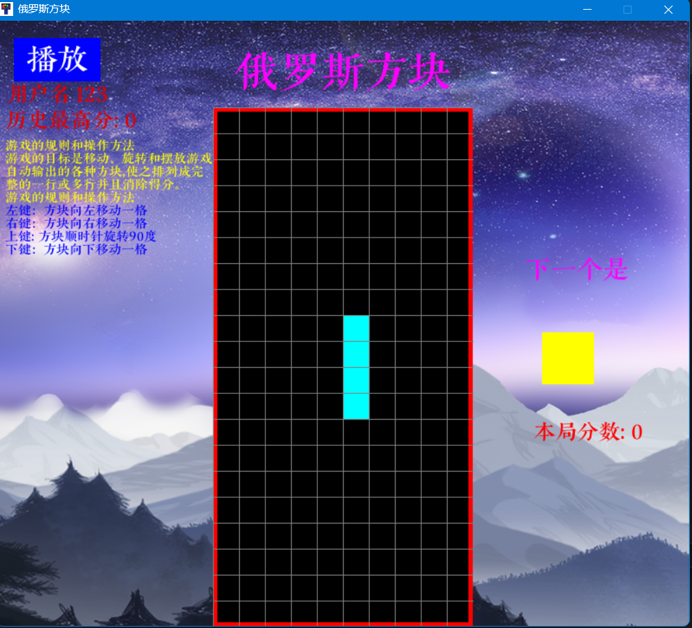

# Catalogue

**其他语言版本: [English](README.md), [中文](README_zh.md).**

- [Catalogue](#catalogue)
  - [Download link](#download-link)
  - [Function](#function)
  - [Program Structure](#program-structure)
  - [Introduce](#introduce)
  - [Installation and operation mode](#installation-and-operation-mode)
    - [Install Python library](#install-python-library)
    - [Run a program](#run-a-program)
      - [Method 1](#method-1)
      - [Method 2](#method-2)

## Download link

[Click here to download](https://github.com/WorldDawnAres/python-TETRIS/releases)

> This program is a simple Tetris game, packaged using Python 3.10.11 version,
>and may not support systems below Windows 7
>
> Welcome to download and experience if you are interested

## Function

- Start game interface
- Added classic Tetris background music
- There is a simple login interface
- Can record user scores

## Program Structure

```bash
python-TETRIS
├── /game
│   ├── /fonts
│   │   ├── font1.ttf
│   ├── /picture
│   │   ├── background.jpg
│   │   ├── background1.jpg
│   │   ├── background2.jpg
│   │   ├── icon.jpg
│   │   └── music.mp3
│   ├── __init__.py 
│   ├── menu.py
│   ├── Sound.py
│   ├── UI.py
│   ├── User.py
├── /README.md
└── /README_zh.md
```

## Introduce

>This program controls the movement of blocks through the up, down, left, and right
>keys on the keyboard
>
>The program is written in Python and uses the Pygame library to implement game logic
>and graphical interface.
>
>The following image shows the start game interface



>We used the SQLite3 database to store user information, including usernames and passwords.
>
>The following figure shows the login interface



>The game interface includes score display and prompt information at the end of the game.



## Installation and operation mode

### Install Python library

>Use the following command to install the required Python libraries:

```bash
pip install pygame sqlite3
pip install PyInstaller(optional)
```

### Run a program

>You can use any of the following methods to run the program:

#### Method 1

>Using PyInstaller to package programs:

```bash
PyInstaller -F --add-data "picture/*;picture" --add-data "fonts/*;fonts" -w -i game\picture\icon.jpg UI.py
```

>Then find the executable file in the dist directory.

#### Method 2

>Directly run Python script:

```bash
python UI.py
```
