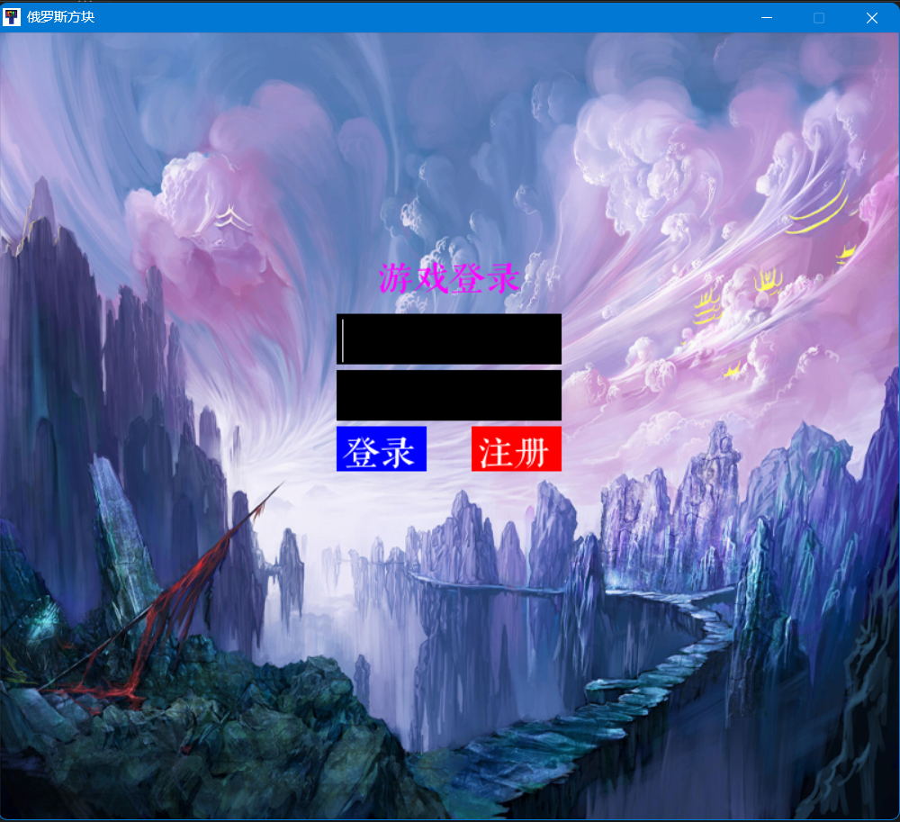

# 目录

**Read this in other languages: [English](README.md), [中文](README_zh.md).**

- [目录](#目录)
  - [下载地址](#下载地址)
  - [功能](#功能)
  - [程序结构](#程序结构)
  - [介绍](#介绍)
  - [安装和运行方式](#安装和运行方式)
    - [安装python库](#安装python库)
    - [运行程序](#运行程序)
      - [方法一](#方法一)
      - [方法二](#方法二)

## 下载地址

[点击此处进行下载](https://github.com/WorldDawnAres/python-TETRIS/releases)

> 该程序是一个简单俄罗斯方块游戏，打包时使用Python3.10.11版本打包，可能不支持Windows7以下系统使用
>
> 欢迎感兴趣的下载体验

## 功能

- 开始游戏界面
- 添加了经典俄罗斯方块背景音乐
- 有简单登录界面
- 可以记录用户分数

## 程序结构

```bash
python-TETRIS
├── /game
│   ├── /fonts
│   │   ├── font1.ttf
│   ├── /picture
│   │   ├── background.jpg
│   │   ├── background1.jpg
│   │   ├── background2.jpg
│   │   ├── icon.jpg
│   │   └── music.mp3
│   ├── __init__.py 
│   ├── menu.py
│   ├── Sound.py
│   ├── UI.py
│   ├── User.py
├── /README.md
└── /README_zh.md
```

## 介绍

>这个程序通过键盘的上下左右键来控制方块移动
>
>程序使用Python编写，使用Pygame库来实现游戏逻辑和图形界面。
>
>下图是开始游戏界面


>使用了sqlite3数据库来存储用户信息，包括用户名和密码。
>
>下图为登录界面



>在游戏界面包含了分数显示，以及游戏结束时的提示信息。


## 安装和运行方式

### 安装python库

>使用以下命令安装所需的Python库:

```bash
pip install pygame sqlite3
pip install PyInstaller(可选)
```

### 运行程序

>你可以使用以下任一方式来运行程序：

#### 方法一

>使用 PyInstaller 打包程序：

```bash
PyInstaller -F --add-data "picture/*;picture" --add-data "fonts/*;fonts" -w -i game\picture\icon.jpg UI.py
```

>然后在 dist 目录下找到可执行文件。

#### 方法二

>直接运行 Python 脚本：

```bash
python UI.py
```
